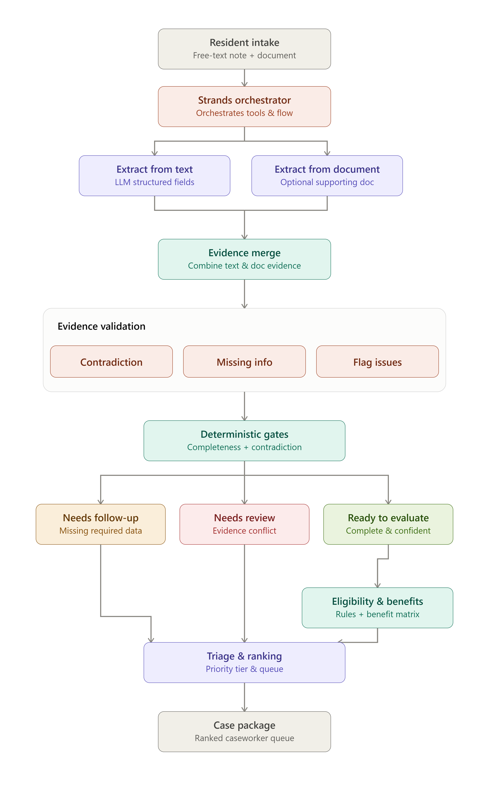

# AID Navigator

**Turning a resident's own words into a caseworker's next right action.**

AID Navigator is an AI agent, built with the [Strands Agents SDK](https://strandsagents.com) and deployed on [Amazon Bedrock AgentCore Runtime](https://docs.aws.amazon.com/bedrock-agentcore/latest/devguide/), that reads a DC resident's utility-assistance intake; in their own words, plus any supporting document text — and turns it into a verified, auditable eligibility decision or a specific next step. It uses GPT-OSS 120B through Groq as its model provider. Built for the AWS "Agents for Humans" hackathon, Good Neighbor track.

---

## The Problem

Every year, thousands of DC households facing utility disconnection apply for LIHEAP (Low Income Home Energy Assistance Program) support. Intake is manual: a caseworker listens to a resident's story, cross-references it against income documents and utility bills, checks it against DC DOEE's eligibility tables, and decides, often under time pressure, with a genuinely urgent case sitting in a queue behind less urgent ones.

That process is repetitive, error-prone under load, and the highest-priority cases don't always surface first. AID Navigator handles the busywork, reading the story, extracting the facts, checking them against evidence, applying the actual DOEE rules, so a caseworker's time goes to the judgment calls that need a human, not the paperwork that doesn't.

**Who it's for:** DC DOEE caseworkers and intake staff processing LIHEAP applications, and by extension, the residents whose cases get resolved faster and more consistently.

**Why it matters:** for a household with a shutoff notice already issued, the difference between same-day triage and a multi-day queue can mean losing heat or power. Consistent, auditable, fast intake isn't a convenience feature here, it's the point.

---

## What It Does

1. A caseworker pastes what the resident told them, in plain language, and optionally attaches a supporting document.
2. AID Navigator extracts the relevant facts with a confidence score and source for every field.
3. If a document was attached, it's extracted independently and cross-checked against the resident's own statement.
4. If required information is missing, the system asks a specific follow-up question instead of guessing.
5. Once the case is complete, deterministic rules, not the LLM, decide eligibility, benefit amount, and crisis status.
6. Across a batch of cases, the system ranks them into a caseworker's triage queue.


## Agentic Control vs Deterministic Control

The Strands agent owns evidence investigation and tool selection.

It decides whether the available evidence warrants:
- further extraction,
- document cross-checking,
- contradiction checking,
- requesting missing information, or
- escalating to a caseworker.

The deterministic Python layer owns the safety-critical conclusions:
- required-field validation,
- contradiction gates,
- eligibility,
- benefit calculation,
- crisis qualification, and
- final triage ranking.

This separation gives AID Navigator agentic behavior without allowing
an LLM to make an authoritative benefits decision.


## Key Differentiators

**"LLM extracts, code decides."** The LLM's only job is producing structured, evidence-backed facts. It never decides eligibility, never computes a benefit amount, and never resolves a contradiction on its own. Every decision that matters is made by deterministic Python functions applying DC DOEE's actual FY26 rules, auditable, reproducible, and impossible for a model's judgment to silently override.

**Auditable by design, not by afterthought.** Every extracted fact carries its source (`text`, `document`, or `both`) and a confidence score. Every eligibility outcome cites the exact rule that fired, `"annual_income_within_limit_for_household_size_3: 42000.0 <= 99897.0"` , not a black-box verdict.

**Contradiction detection that stops, not guesses.** When a resident's stated income disagrees with their income verification letter by more than 5%, the system doesn't average the two or trust the more confident source, it halts before eligibility and routes the case to `NEEDS CASEWORKER REVIEW`, showing both values side by side.

**Missing data becomes a question, not a crash or a guess.** If home type or heating fuel is never mentioned, the system doesn't fabricate a plausible default, it returns the specific question a caseworker needs answered, while preserving every fact that *was* successfully extracted.

**Crisis-aware triage.** Priority isn't just "eligible or not", the system distinguishes confirmed crisis-eligible cases, urgent-but-incomplete cases, contradiction cases needing review, and routine eligible/ineligible cases, and ranks a batch accordingly.

---

## Architecture

AID Navigator runs each case through a deterministic decision pipeline:

- **Triage priority:** crisis → urgent-incomplete → contradiction → eligible
- **Eligibility:** DC DOEE FY26 income and crisis rules, with benefits resolved via a fixed lookup table (not LLM-generated)
- **Missing/uncertain data:** required field missing or low-confidence → case stops with a specific follow-up question
- **Conflicting evidence:** >5% income disagreement or any mismatch on an exact-match field → case flagged for caseworker review, blocked from auto-eligibility




**Why the Strands Agent is used this way:** see [Agentic Control vs Deterministic Control](#agentic-control-vs-deterministic-control) above.

**Why Groq:** the project began on Amazon Bedrock. Bedrock access was blocked during development, so extraction was migrated to Groq (`openai/gpt-oss-120b`) to keep development moving. This is documented as a development-speed decision, not a permanent architectural stance.

**Why AgentCore Runtime:** `runtime.py` is the hosted entry point. AgentCore receives a JSON intake request, invokes the existing extraction and deterministic decision pipeline, and returns the case evidence, next action, eligibility result, and triage classification. The Streamlit app remains the local caseworker interface.

---

## How It Works

**1. Extraction.** A structured prompt asks the model to return exactly ten fields (household size, income, home type, heating fuel, disconnection status, arrears, fuel tank %, heat-in-rent, stated urgency, applicant name) with a confidence score per field, temperature 0. Fields genuinely absent from the source must return `null`, not a fabricated default verified against multiple adversarial test cases designed to bait the model into guessing (e.g., annualizing an unsteady monthly income, or inferring heating fuel from an electric *utility* bill that never mentions heating).

**2. Schema validation.** Pydantic v2 validates every extracted field. Fields the eligibility engine cannot function without (household size, home type, heating fuel, disconnection status, income) are required; everything else is genuinely optional, matching what the extraction prompt actually promises the model it can return.

**3. Next-Best-Action.** A deterministic module, no LLM call, checks whether required fields are present *and* above a confidence floor. A low-confidence guess is treated the same as a missing field, not trusted at face value. Missing fields produce a specific, human-readable follow-up question. Urgency is detected independently from the structured `disconnection_status` field and, as a fallback, from urgency language in the source text.

**4. Merge and contradiction check.** When both a text statement and a document are supplied, fields present in both sources are merged: agreement raises confidence and marks the source as `"both"`; disagreement beyond tolerance (5% for income, exact match for everything else) halts the pipeline and returns a `needs_review` case instead of silently picking one value.

**5. Eligibility.** Deterministic functions apply DC DOEE's actual FY26 income limits and crisis criteria (arrearage remaining after the regular benefit ≥ $250, and either disconnected or fuel tank ≤5%). Every result states the exact rule that fired.

**6. Triage.** A batch of processed cases is ranked into six priority tiers — crisis-eligible, urgent-but-incomplete, unresolved contradiction, regular-eligible, incomplete/no urgency, ineligible — with ties broken by ascending confidence (the shakier extraction gets looked at first).

---

## Demo

- **Video:** [link]
- **Live demo:** [link, if deployed]

Representative outcomes shown in the demo:
- **Crisis eligible** — complete case, benefit insufficient to clear arrears, disconnection confirmed
- **Regular eligible, not crisis** — complete case, income within limits, no emergency condition
- **Not eligible** — complete case, income exceeds the household-size limit
- **Needs follow-up** — urgent case (disconnection stated) missing required information
- **Needs caseworker review** — resident's stated income and a supporting document disagree by more than the tolerance threshold

---

## Getting Started

```bash
git clone https://github.com/rabbiyariaz/AgentForHuman_AID_Navigator.git
cd AgentForHuman_AID_Navigator
python -m venv .venv
.venv\Scripts\activate        # Windows
source .venv/bin/activate     # macOS/Linux
pip install -r requirements.txt
```

Create a `.env` file in the project root:
```
GROQ_API_KEY=your_key_here
```

Run the demo batch:
```bash
python main.py
```

Run the Streamlit UI:
```bash
streamlit run app.py
```

### Deploy to AgentCore Runtime

From the `aid_navigator` directory, install the deployment dependencies and configure AWS credentials with permission to create and invoke an AgentCore Runtime:

```bash
pip install -r requirements.txt
agentcore configure -e runtime.py
agentcore launch
```

Set the model provider secret in the deployed runtime environment:

```text
GROQ_API_KEY=your_key_here
GROQ_MODEL=openai/gpt-oss-120b
```

The runtime accepts this request shape:

```json
{
    "text": "Household of 3, annual income $42,000, single-family home, natural gas, disconnected, and $480 in arrears.",
    "document_text": "Optional supporting document text"
}
```

It returns a JSON object containing `case` and `triage`. Cases with missing required information return `needs_followup`; conflicting sources return `needs_review`; only complete, consistent cases reach deterministic eligibility evaluation.

---

## Project Structure

```
aid_navigator/
├── agent/
│   ├── tools.py              # extract_from_text, extract_from_document, check_contradiction
│   ├── extraction_agent.py   # Strands agent + run_extraction_pipeline orchestration
├── nba/
│   └── next_best_action.py   # Next-Best-Action: missing-field detection, urgency flagging
├── rules/
│   ├── eligibility.py        # DC DOEE FY26 income + crisis rules
│   ├── benefit_lookup.py     # Benefit amount table lookup
├── triage/
│   └── ranking.py             # Batch case ranking
├── schema/
│   └── models.py             # Pydantic models: extracted fields, audit trail, evidence
├── main.py                   # CLI entry point — runs demo case batch
└── tests/
    ├── test_benefit_lookup.py # Benefit table lookup tests
    ├── test_eligibility.py    # Income/crisis boundary test coverage
    └── test_extraction.py     # Extraction orchestration tests
```

---

## Testing

```bash
pytest -q
```

Current coverage: income eligibility boundaries by household size, crisis eligibility branching (arrearage threshold, disconnection, fuel tank), and benefit lookup. Extraction behavior was validated through targeted adversarial manual testing during development (see [Known Limitations](#known-limitations--roadmap) for what remains to formalize into automated fixtures).

---

## Known Limitations & Roadmap

Stated plainly, not as an afterthought:

- **Document support is plain text only.** No OCR or PDF parsing yet. A real intake document would need to be transcribed to text first; this is a scope boundary for the hackathon.
- **Identity and legal-presence verification (photo ID, Social Security) is out of scope.** DOEE performs this separately during real processing; it isn't an eligibility input and this system was never designed to replace it.
- **Groq is used for development speed; the extraction interface is provider-agnostic by design** (a single `_call_llm` function), making a future move to Amazon Bedrock a scoped, isolated change rather than a rearchitecture.

---

## Built With

- [Strands Agents SDK](https://strandsagents.com) — agent orchestration and tool execution
- [Amazon Bedrock AgentCore Runtime](https://docs.aws.amazon.com/bedrock-agentcore/latest/devguide/) — hosted runtime and deployment boundary
- [Groq](https://groq.com) (`openai/gpt-oss-120b`) — LLM extraction
- [Pydantic v2](https://docs.pydantic.dev) — structured validation and evidence schema
- [Streamlit](https://streamlit.io) — caseworker-facing UI
- Python 3.12

---

## License

This project is licensed under the MIT License — see the [LICENSE](LICENSE) file for details.
---

   ## AWS Builder ID & Build Story

A three-part series on building AID Navigator:

1. [Building AID Navigator: What I Learned Deploying a Strands Agent to Bedrock AgentCore](https://builder.aws.com/content/3JE7Rl04h6HUGSlNmBGOWuN5ZDt/building-aid-navigator-what-i-learned-deploying-a-strands-agent-to-bedrock-agentcore-agentsforhumans)
2. [My First Time on AWS: What Building AID Navigator Actually Taught Me](https://builder.aws.com/content/3JGy7LiKA1UEETD9vVtJTwusXPx/my-first-time-on-aws-what-building-aid-navigator-actually-taught-me-agentsforhumans)
3. [Why AID Navigator's Agent Isn't Allowed to Decide Anything](https://builder.aws.com/content/3JGzh0dKseyNibtNW9VePVRXrAD/why-aid-navigators-agent-isnt-allowed-to-decide-anything-agentsforhumans)
   
   *(If the link above returns a 403 error, copy and paste the URL directly into your browser, this is a known CloudFront referrer-blocking issue on AWS Builder Center, not a broken link.)*
